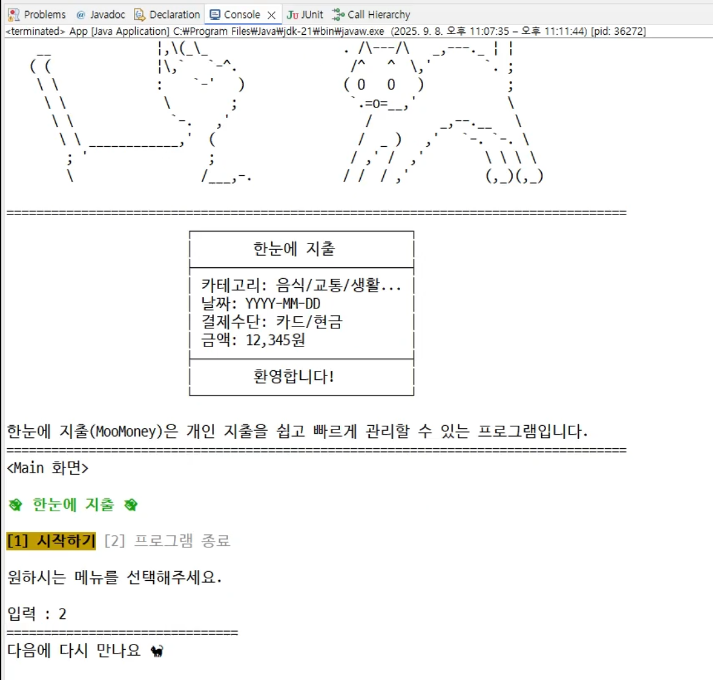
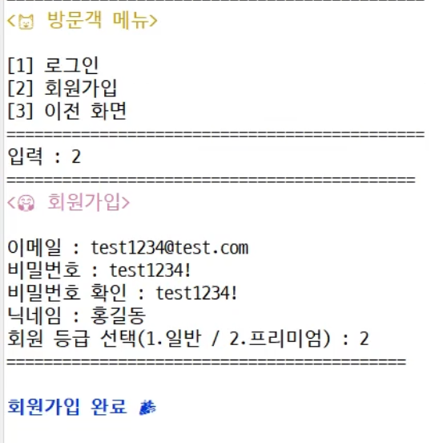
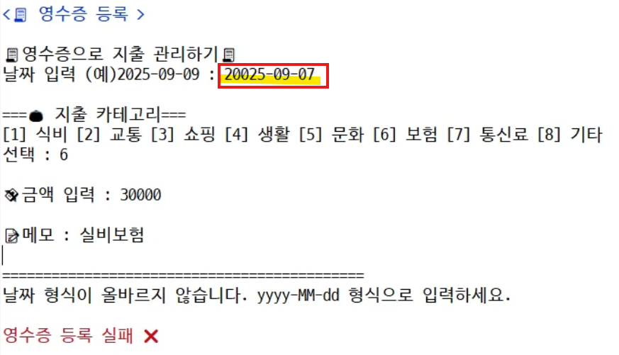
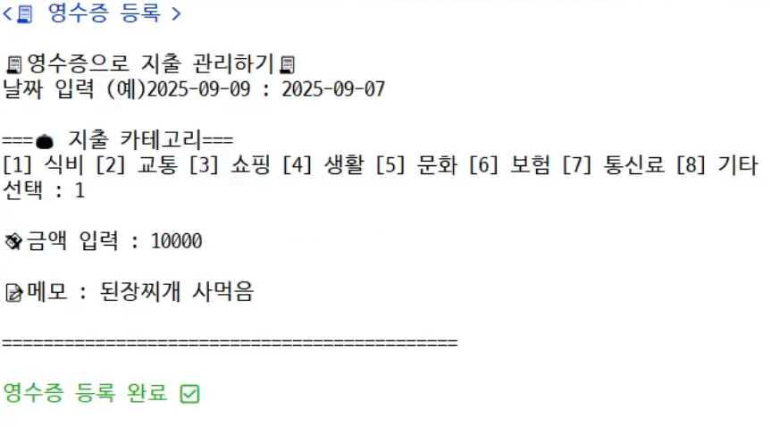
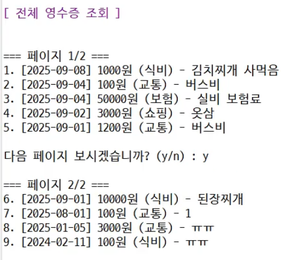
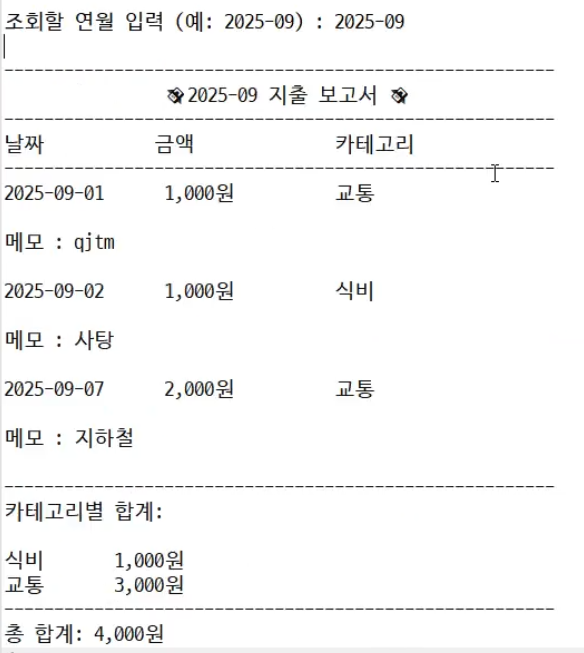
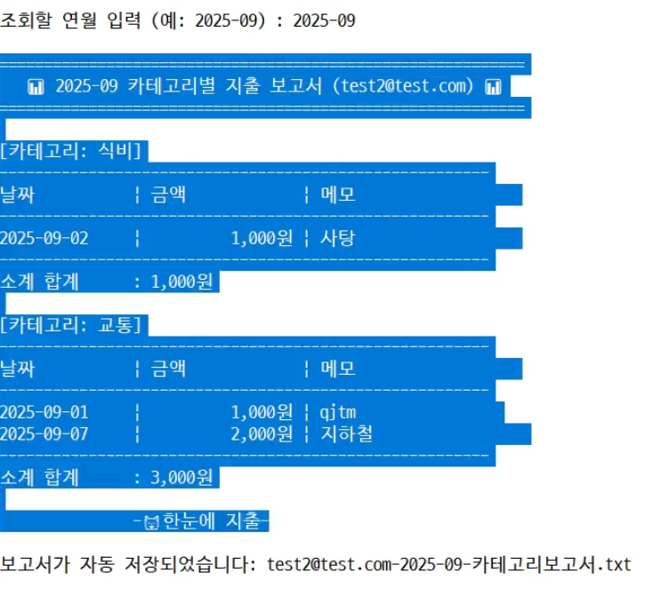

# 😸 한눈에 지출  
3.png)    

한눈에지출(MooMoney)은 사용자가 지출을 등록하고, 한눈에 분석할 수 있는 친근한 지출 관리 프로그램입니다.  

## 📝 프로젝트 개요
- **Java 콘솔 기반 CLI 지출 관리 프로그램**
- 개발 기간 : 2025/09/05 ~ 2025/09/08(4일간)
- 개인 프로젝트로 진행
- 🔗 **프로젝트 노션 페이지** : https://recondite-spirit-809.notion.site/Moo-Money-2659879dac8680999c96d92654240dac?source=copy_link


## 🐈 주요 기능
- 회원 관리(회원가입, 로그인, 로그아웃)
- 영수증 관리(등록, 조회), 보고서 출력
- 권한별 기능 분리: 게스트, 일반회원, 프리미엄 회원


## 🔨 기술 스택
- **Java**: JDK 17
- **아키텍처**: MVC(Model-View-Controller)
- **파일 기반**: TXT, CSV(OpenCSV 활용)
- **디자인 패턴**:  
  - 팩토리 패턴 (컨트롤러/뷰)  
  - 템플릿 메서드 패턴 (뷰 공통 구조)
  - 싱글톤
- **입력 처리**: BufferedReader 싱글톤(`InputReader`)
- **보안**: 비밀번호 Salt + Hash 처리
- **파일 입출력**
  - 문자 기반 스트림(`FileReader` / `FileWriter`)
  - 보조 스트림(`BufferedReader` / `BufferedWriter`)

### 📁 폴더 구조
```
MooMoney/
├─ data/                    # 실행 중 생성/사용되는 데이터 파일
│   ├─ users.csv
│   └─ receipts.csv
├─ src/
│   ├─ main/
│   │   └─ java/
│   │       └─ io/github/choimari/moomoney/
│   │           ├─ App.java                 # 프로그램 진입점(main())
│   │           ├─ model/                   # User, Receipt 등
│   │           ├─ dto/                     # 컨트롤러 <-> 서비스 데이터 전달용
│   │           ├─ repository/              # 파일 I/O 처리
│   │           ├─ service/                 # 업무 로직 
│   │           ├─ controller/              # 사용자 입력값 검증 + Service 호출
│   │           ├─ view/                    # 출력 전담
│   │           └─ util/                    # 공용 기능 (Logger, InputReader)
│   └─ test/
│       └─ java/
│           └─ io/github/choimari/moomoney/
│
└─ lib/                         # 필요한 외부 jar (JUnit, OpenCSV 등)

```

### 🐈‍⬛ GitFlow 브랜치 전략 및 PR 활용
```
💡main ← 최종 배포용, 항상 안정적
└─ develop ← 개발 통합본
├─ feature/기능명 ← 기능별 작업
├─ fix/버그명 ← 버그 수정
├─ hotfix/긴급패치 ← 운영 중 긴급 패치
└─ release/버전명 ← 배포 준비
```

## 📦 배포
.jar 파일  
포함 라이브러리: lib/ 폴더의 OpenCSV, 롬복  
Windows CMD, PowerShell에서 실행 가능  
데이터 파일 생성: .txt와 .csv는 JAR 실행 경로 기준으로 생성
```
cd #.jar파일 저장시킨 경로로 이동
java -jar moo-money-1.0.0.jar #실행
```

## 📷 실행 화면(스크린 샷)
  
  
 
 
 
 
 





